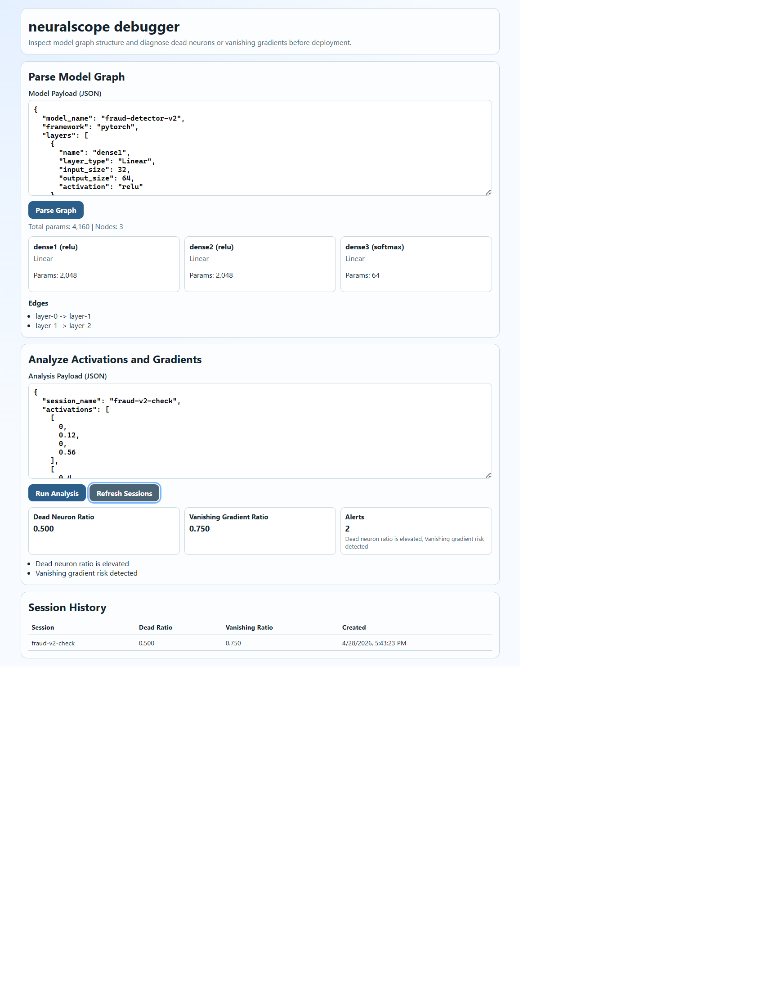

# neuralscope

Interactive neural network visual debugger for model graph inspection and activation/gradient health analysis.

## What It Does

1. Parses layer configuration into graph nodes and edges.
2. Estimates layer parameter counts and model complexity signals.
3. Analyzes activation sparsity and dead-neuron ratios.
4. Detects gradient vanishing risk from captured gradient values.
5. Stores analysis sessions with API and dashboard visibility.

## Stack

- Backend: FastAPI + SQLite
- Frontend: React + Vite + TypeScript
- Deployment: Docker, Docker Compose, GitHub Actions, GHCR, GitHub Pages

## Dashboard Screenshot



## Quick Start

```bash
cp .env.example .env
cd backend
python -m venv .venv
.\.venv\Scripts\Activate.ps1
pip install -r requirements.txt
pytest -q

cd ../frontend
npm install
npm run build
```

Run full stack:

```bash
docker compose --env-file .env -f docker-compose.yml up --build
```

## API and Ops Docs

- docs/API.md
- docs/DEPLOYMENT.md
- docs/OPERATIONS.md
- docs/FUTURE-CLARIFICATIONS.md

## Current Status

- v0.1.0 baseline: deploy-ready foundation
- Next: live hook integrations for PyTorch/TF runtime captures and richer graph rendering
